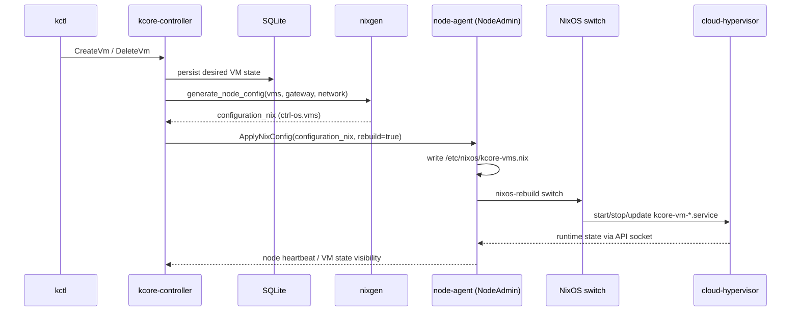

# kcore-rust Architecture

This document shows how `kctl`, `kcore-controller`, Nix config generation, and `kcore-node-agent` work together to manage VMs declaratively.

## High-level flow

```mermaid
flowchart LR
  U[Operator] --> K[kctl CLI]
  K -->|gRPC API calls| C[kcore-controller]

  C -->|Read/Write desired state| DB[(SQLite DB)]
  C -->|Select node| S[Scheduler]
  C -->|Generate Nix text<br/>ctrl-os.vms| NIXGEN[nixgen::generate_node_config]

  NIXGEN -->|ApplyNixConfig(configuration_nix, rebuild=true)| A[kcore-node-agent<br/>NodeAdmin]
  A -->|write file| CFG[/etc/nixos/kcore-vms.nix]
  A -->|trigger| REBUILD[nixos-rebuild switch]

  REBUILD --> MOD[ctrl-os-vms Nix module]
  MOD --> NET[bridge/tap + NAT systemd services]
  MOD --> VMUNIT[kcore-vm-*.service]
  VMUNIT --> CH[cloud-hypervisor]

  CH --> SOCK[/run/kcore/*.sock]
  A -->|NodeCompute reads VM status| SOCK
  A -->|heartbeat / VM info| C
```

## Component responsibilities

- `kctl` sends user intent (create/delete/start/stop/get/list).
- `kcore-controller` stores desired state, picks a target node, and renders declarative Nix VM config.
- `nixgen::generate_node_config` produces the `ctrl-os.vms` block (networks + virtualMachines).
- `kcore-node-agent` writes the config file and applies it via `nixos-rebuild switch`.
- `ctrl-os-vms` module realizes networking, TAP devices, seed ISOs, and VM systemd services.
- `cloud-hypervisor` runs VMs; node-agent queries runtime state from API sockets.

## Create/Delete VM lifecycle


