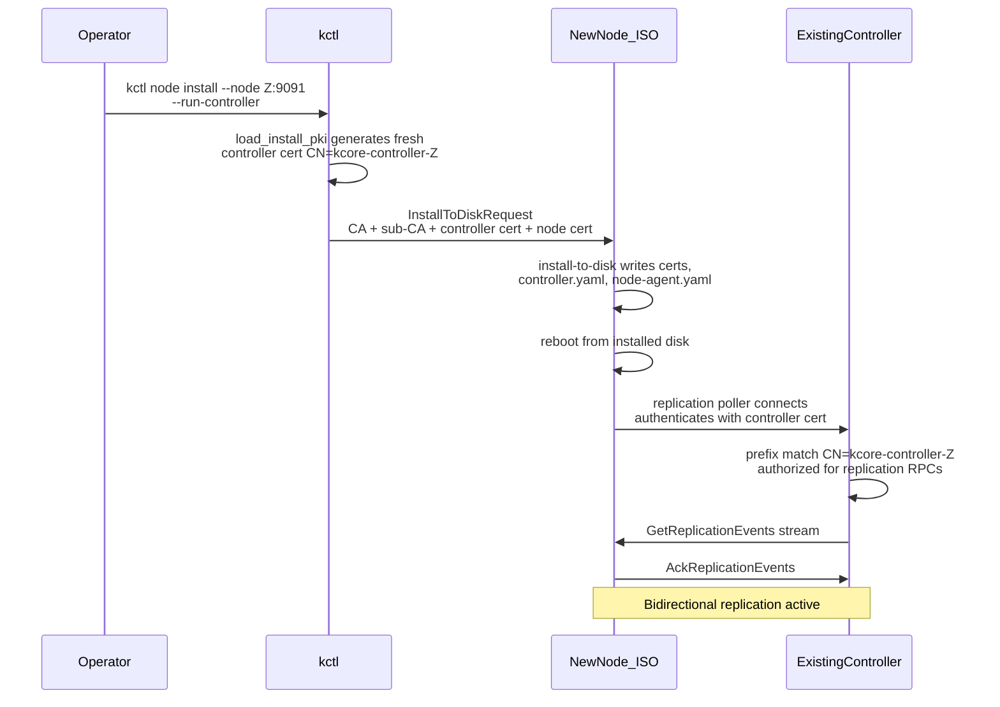
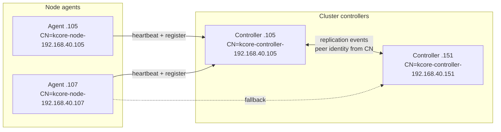
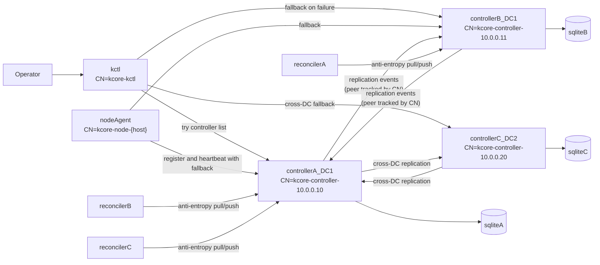
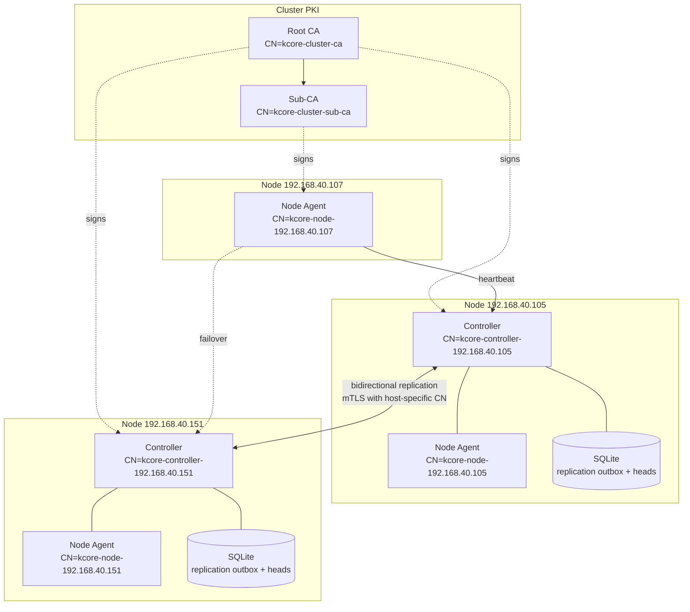

# Controller HA, Replication, and DC Topology Plan

This document defines the target design for multi-controller HA in kcore-rust using a hybrid CRDT model, including:

- datacenter (`DC`) identity and defaults
- controller-to-controller replication and anti-entropy reconciliation
- node-agent and `kctl` controller fallback behavior
- TLA+ model scope for protocol validation

The current implementation is single-controller in several paths. This document is a phased implementation plan to evolve safely without destabilizing current VM workflows.

## Goals

- Keep control-plane availability when one controller is down.
- Replicate controller state across peers and across datacenters.
- Introduce a `dc_id` concept everywhere with default `DC1`.
- Support explicit node installation into a DC; if omitted, use `DC1`.
- Allow node-agents and `kctl` to fail over to alternate controllers.
- Preserve operator intent under concurrent writes (avoid silent loss).

## Non-goals

- Full linearizability across all controllers and all writes.
- Raft-style strict leader semantics for every operation.
- Replacing SQLite in the first milestone.

## Terminology

- `dc_id`: datacenter identifier (`DC1`, `DC2`, ...). Default: `DC1`.
- `controller_id`: stable logical ID for a controller instance.
- `peer`: another controller participating in replication.
- `resource`: replicated object (`node`, `vm_spec`, `vm_runtime`, `network`, `ssh_key`, ...).

## Defaulting and install semantics

- If `dc_id` is not specified:
  - controller runs in `DC1`
  - node installs into `DC1`
  - resources are tagged with `dc_id=DC1`
- `.105` can be set ad-hoc to `DC1`, but install-time config must persist it in node-agent config.
- Future `kctl node install` flag shape:
  - `--dc-id DC1` (optional, default `DC1`)
  - `--join-controller` can become repeatable to pass multiple controllers.

## CRDT strategy (hybrid)

Use different merge semantics by data class.

### 1) Operational/runtime state: LWW

Apply LWW registers for:

- node heartbeat and last-seen timestamps
- node readiness status
- VM runtime state and VM discovered IP

Reason: these fields naturally represent latest observation and are high-churn.

### 2) Desired declarative state: MV/OR model

Use OR-Map + MV-register style entries for:

- VM desired spec
- network desired spec
- labels and policy-like metadata
- SSH key associations

Reason: concurrent edits should not silently overwrite user intent.

### 3) Deletes and GC

- Use tombstones with causal metadata.
- Delay GC until all known peers acknowledge observing the tombstone frontier.

## Replication architecture

Each controller keeps SQLite, plus replication metadata tables:

- `controller_peers`: known peers, DC, endpoint, health.
- `replication_log`: append-only mutation events with causal metadata.
- `replication_ack`: per-peer ack frontier (event id/vector).
- `resource_heads`: latest merged causal state by resource id.

Realtime replication and periodic anti-entropy are both required.

### Realtime path

1. RPC mutates local DB.
2. Mutation emits replication event.
3. Event is sent to peers asynchronously.
4. Peer merges event via CRDT rules and persists merged state.

### Reconciler path (anti-entropy)

Run in-process as a background async task in controller `main`.

- Periodically compare frontiers with each peer.
- Pull missing ranges from peer logs.
- If a gap is no longer available (compaction), request snapshot sync for that scope.
- Re-run referential integrity checks and emit repair events.

This is needed even with CRDTs, because transport and peer uptime are not perfect.

## Join flow for second controller

Each controller gets a unique identity via its TLS certificate CN (`kcore-controller-{host}`), generated fresh at install time. No join token is required; the shared cluster CA is the trust root.

### How a controller is added

### Controller identity and replication peer tracking

Each controller's replication ack frontier is tracked by its CN-derived peer ID. Because every controller has a unique CN, there are no identity collisions even when multiple controllers are added simultaneously.

### Steps

1. `kctl create cluster` generates cluster CA and first controller cert.
2. First controller installs with `--run-controller` and starts as standalone.
3. Second controller installs with `--run-controller` and is configured with the first controller as a replication peer.
4. After reboot, the second controller's poller connects to the first and pulls replication events.
5. When the second controller pulls from the first and acknowledges events, the first controller auto-discovers the second via `ack_replication_events` and registers it in `controller_peers`. The peer discovery loop then starts polling the second controller, establishing bidirectional replication automatically.
6. Both controllers authenticate via mTLS using their host-specific certificates.
7. Node inventory converges after node-agents heartbeat and register events are replicated.

## Node-agent and kctl fallback behavior

### Node-agent

- Config moves from single `controller_addr` to ordered list:
  - `controllers: ["10.0.0.10:9090", "10.0.0.11:9090"]`
- Registration and heartbeat use first reachable controller, with retry/backoff and rotation.
- Cert renewal follows active controller; if renewal fails on active peer, try next trusted peer.

### kctl

- Context supports multiple controllers:
  - `controllers: [...]` with deterministic attempt order.
- For each command:
  - try controllers in order
  - on transport/unavailable error, try next
  - if all fail, exit non-zero with clear operator error

## Scheduler and node-info considerations

- Scheduler reads eventually-consistent replicated state.
- Placement must verify required invariants at commit time (node exists, approved, capacity constraints).
- If split-brain creates conflicting desired VM placement, expose conflict and block unsafe apply until resolved.

## Mermaid overview

## Controller list and cluster topology

The following diagram shows a typical 3-node production cluster with two controllers and one agent-only node:

## Pros and drawbacks of CRDT approach

### Pros

- Higher write/read availability than strict leader-only designs.
- Better resilience to partitions and transient outages.
- Natural fit for geo/distributed control planes.
- Supports asynchronous replication and later reconciliation.

### Drawbacks

- Eventual consistency means temporary divergent views.
- Conflict semantics must be explicit and operator-visible.
- Metadata growth (vectors/tombstones) requires compaction strategy.
- Harder debugging than single-writer linearizable state.

## TLA+ scope and repo plan

Use TLA+ to validate safety/liveness before full rollout.

Planned spec modules:

- `specs/tla/ControllerNodeReconcile.tla`
- `specs/tla/ControllerReplication.tla`
- `specs/tla/CrossDcReplication.tla`

Modeled properties:

- Controller to node convergence after failure/recovery.
- No orphan VM desired state after controller crash/restart.
- Replication convergence across peer controllers.
- Cross-DC eventual convergence under partition/rejoin.

### About generating definitions for Rust

TLA+ does not generate Rust code directly. The practical bridge is:

1. define a shared replication contract schema (event types + fields),
2. generate machine-readable snapshots/traces from Rust tests,
3. check those traces against TLA+ invariants in CI.

This keeps the model and implementation aligned without claiming direct code generation.

## Phased implementation

### Phase 1: topology and fallback primitives

- Add `dc_id` config/defaulting (`DC1`) to controller/node-agent/install flow.
- Add multi-controller endpoint list to node-agent and `kctl`.
- Implement failover retries for `kctl` and node-agent registration/heartbeat.

Status: baseline implementation in progress and partially delivered:

- `kctl` supports ordered fallback controllers from context and repeatable `--controller`.
- node-agent supports controller endpoint lists, heartbeat fallback, and renewal fallback.
- install flow supports repeatable `--join-controller` and `--dc-id`, persisting `controllers` and `dcId` in node-agent config.

### Phase 2: replication event log and merge engine

- Add replication tables and event emitters around controller mutations.
- Add peer RPCs for event exchange and frontier acknowledgement.
- Implement hybrid merge semantics (LWW runtime, MV/OR desired state).

Status (incremental):

- Controller config accepts optional `replication` (`controllerId`, `dcId`, `peers`). When present, mutating RPCs append JSON envelopes to SQLite table `replication_outbox` (migration v11).
- Emitters wired for `node.register` and `vm.create` (after successful node push). Peer fan-out, merge engine, and `replication_log` / ack frontiers are not implemented yet.
- ControllerAdmin includes early replication transport RPCs: `GetReplicationEvents(after_event_id, limit)` and `AckReplicationEvents(peer_id, last_event_id)`. These currently page from `replication_outbox` and store per-peer frontier in `replication_ack`.
- Replication envelopes now carry causal/event identity fields (`schemaVersion`, `opId`, `logicalTsUnixMs`, `controllerId`, `dcId`) and receivers dedupe incoming events by `opId` using `replication_received_ops`.

### Phase 3: in-process reconciler

- Start anti-entropy task from controller `main`.
- Per-peer periodic sync with backoff, snapshot fallback, and metrics.
- Add integrity repair checks (missing references, tombstone consistency).

Status (incremental):

- Controller now starts per-peer background pollers when `replication.peers` is configured. Pollers use `GetReplicationEvents` and `AckReplicationEvents`, maintain a local pull frontier, and skip self-referential peer endpoints.
- Pollers now include a typed event-apply path that validates JSON payloads, updates deterministic heads, and tracks an `apply/<peer>` frontier separate from pull progress.
- `ControllerAdmin.GetReplicationStatus` exposes replication health counters (`outbox_head_event_id`, `outbox_size`, outgoing ack lag, and incoming pull/apply frontiers).
- Apply path now maintains `replication_resource_heads` using deterministic LWW ordering (`logicalTsUnixMs`, then `controllerId`, then `opId`) and drives domain materialization for node/network/vm/security-group and ssh-key event families.
- Equal-timestamp cross-controller contenders are now logged into `replication_conflicts`; `GetReplicationStatus` reports an `unresolved_conflicts` count for operator visibility.
- Deterministic zero-manual arbitration model is documented in `docs/zero-external-resolution-algorithm.md`.
- Controller now runs a domain-aware compensation executor: `auto_compensated` losers enqueue jobs in `replication_compensation_jobs` with loser event metadata and payload snapshots, and handlers apply idempotent corrective actions before marking conflicts resolved.
- Controller now runs a replay-safe head materializer that projects winning `replication_resource_heads` into domain rows (node registration/approval lifecycle, vm lifecycle, network lifecycle, security-group CRUD/attachments, and ssh-key lifecycle) using `replication_materialized_heads`.
- Replication apply now includes an initial reservation ledger gate for `vm.create`; failures are auto-rejected and persisted in `replication_reservations` for audit/retry evolution.

### Phase 4: conflict UX and operator tools

- Add operator visibility commands for conflict and replication maturity status.
- Improve visibility (`replication lag`, `peer health`, `last reconcile`).
- Document operational playbooks for partition and recovery.

Status (incremental):

- ControllerAdmin now exposes conflict APIs: `ListReplicationConflicts(limit)` and `ResolveReplicationConflict(id)` backed by `replication_conflicts`.
- `kctl` now exposes `kctl get conflicts [--limit N]` and `kctl get replication-status [--require-healthy]` for scripting hard SLO gates.
- `GetReplicationStatus` now includes zero-manual SLO metrics and enforcement signals: pending/failed compensation jobs, materialization backlog, unresolved conflict age, failed reservations, and a `zero_manual_slo_healthy` verdict with violation reasons.

### Phase 5: TLA+ validation gates

- Implement three core specs and TLC configs.
- Add CI checks for model invariants on bounded state spaces.
- Track any model-vs-implementation drift via trace checking.

Status (incremental):

- `specs/tla/` contains bounded specs and configs for controller-node reconcile, controller replication, and cross-DC replication.
- A repository check entrypoint now exists via `make test-tla` (backed by `scripts/check-tla.sh`) to run all TLC models in one pass.
- `ControllerReplication.tla` now models outbox/delivery/apply/head/frontier/conflict state and checks safety invariants for deterministic winner selection, no-double-apply semantics, and auto-terminal (no-manual) conflict states.
- `ControllerNodeReconcile.tla` now models deterministic priority-based failover and heartbeat progress with fairness constraints, improving failover-liveness guardrails.
- A trace drift checker now exists (`make test-tla-trace`) to validate sampled replication traces against deterministic winner and auto-terminal assumptions used by the formal model.
- `CrossDcReplication.tla` now models explicit intra-DC vs cross-DC anti-entropy and checks bounded cross-DC convergence/no-double-apply safety.
- Trace drift validation now includes both positive and negative fixtures (expected pass and expected fail) via `scripts/test-replication-trace.sh`, reducing silent checker regressions.
- CI now includes a formal checks workflow (`.github/workflows/formal-checks.yml`) that enforces trace drift checks and requires bounded TLC model checks.
- The trace gate now consumes a generated artifact emitted from a Rust replication test (`replication::tests::export_replication_trace_fixture`) in addition to static fixtures, reducing model-vs-implementation drift risk.
- Generated trace rows now include reservation and compensation branch signals (`reservation_status`, `compensation_status`) so drift checks cover zero-manual rejection/compensation paths explicitly.
- Generated traces now exercise both compensation lifecycle states (`queued` and `completed`) by processing one compensation job during export.
- VM create now performs reservation-style preflight checks on target node readiness/approval/capacity before persisting intent, reducing avoidable reservation failures downstream.
- Preflight capacity/readiness failures now include deterministic scheduling hints (up to three alternative compatible nodes), reducing operator trial-and-error.
- Reservation failures are now classified as retryable vs non-retryable with a bounded retry budget (`retry_exhausted` terminal reservation status), and status metrics expose the split.
- A background reservation retry executor now re-checks `failed_retryable` rows (with cooldown) and auto-promotes them to `reserved` when nodes recover, or auto-escalates to `retry_exhausted`.
- VM create now auto-falls back to a compatible alternative node when an explicit `target_node` fails storage/preflight checks, reducing manual retry loops.
- Replication status now reports `retry_exhausted_reservations` explicitly, separating bounded-retry terminals from in-progress retryable failures.
- Dashboard compliance view now shows replication resilience/SLO counters (including retry-exhausted reservations) using the admin replication-status RPC.

## Inventory Reconcile Runbook (Controller Join/Recovery)

When adding or recovering a controller, explicitly verify that `nodes` inventory converges across controllers.

1. Compare node views:
   - `kcore-kctl -s <controller-a>:9090 get nodes`
   - `kcore-kctl -s <controller-b>:9090 get nodes`
2. Force fresh replicated node snapshots by restarting active node agents:
   - `systemctl restart kcore-node-agent` on each active node.
3. Wait for replication poll/materialization to settle and compare again.
4. If approval status remains divergent for an already trusted node, reconcile on the lagging controller:
   - `kcore-kctl -s <lagging-controller>:9090 node approve <node-id>`
5. Confirm `kcore-kctl get replication-status` is healthy on all controllers.

Expected steady state:
- both controllers return the same active node set with matching approval/state;
- `zero_manual_slo_healthy: true` on each controller.

## Replication hardening — validation evidence (exit criteria)

Automated gates used before merge/release:

- `cargo test -p kcore-controller replication::tests::` — replication merge, materialization, reservations, trace export.
- `cargo test -p kcore-controller grpc::admin::tests::` — admin replication RPCs and monotonic ack behavior.
- `cargo test -p kcore-controller heartbeat_appends_replication_outbox_when_configured` — node heartbeat emits replicated inventory snapshots when replication is enabled.
- `make test-tla-trace` (runs `scripts/test-replication-trace.sh` and `check-replication-trace.py`) — deterministic winner / terminal rules vs trace fixtures.
- `make test-tla` — bounded TLC checks for `ControllerNodeReconcile`, `ControllerReplication`, `CrossDcReplication`.
- `bash ./scripts/soak-replication.sh` — loops the above (default 5 iterations) for soak runs.

Live cluster checks: `kctl get nodes` parity across controllers; `kctl get replication-status --require-healthy` on each controller.
