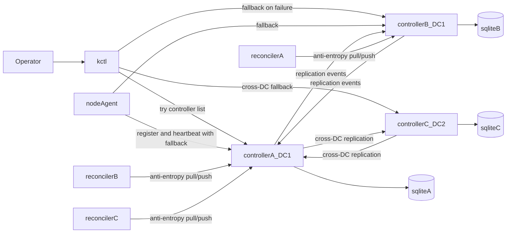

# Controller HA, Replication, and DC Topology Plan

This document defines the target design for multi-controller HA in kcore-rust using a hybrid CRDT model, including:

- datacenter (`DC`) identity and defaults
- controller-to-controller replication and anti-entropy reconciliation
- node-agent and `kctl` controller fallback behavior
- TLA+ model scope for protocol validation

The current implementation is single-controller in several paths. This document is a phased implementation plan to evolve safely without destabilizing current VM workflows.

## Goals

- Keep control-plane availability when one controller is down.
- Replicate controller state across peers and across datacenters.
- Introduce a `dc_id` concept everywhere with default `DC1`.
- Support explicit node installation into a DC; if omitted, use `DC1`.
- Allow node-agents and `kctl` to fail over to alternate controllers.
- Preserve operator intent under concurrent writes (avoid silent loss).

## Non-goals

- Full linearizability across all controllers and all writes.
- Raft-style strict leader semantics for every operation.
- Replacing SQLite in the first milestone.

## Terminology

- `dc_id`: datacenter identifier (`DC1`, `DC2`, ...). Default: `DC1`.
- `controller_id`: stable logical ID for a controller instance.
- `peer`: another controller participating in replication.
- `resource`: replicated object (`node`, `vm_spec`, `vm_runtime`, `network`, `ssh_key`, ...).

## Defaulting and install semantics

- If `dc_id` is not specified:
  - controller runs in `DC1`
  - node installs into `DC1`
  - resources are tagged with `dc_id=DC1`
- `.105` can be set ad-hoc to `DC1`, but install-time config must persist it in node-agent config.
- Future `kctl node install` flag shape:
  - `--dc-id DC1` (optional, default `DC1`)
  - `--join-controller` can become repeatable to pass multiple controllers.

## CRDT strategy (hybrid)

Use different merge semantics by data class.

### 1) Operational/runtime state: LWW

Apply LWW registers for:

- node heartbeat and last-seen timestamps
- node readiness status
- VM runtime state and VM discovered IP

Reason: these fields naturally represent latest observation and are high-churn.

### 2) Desired declarative state: MV/OR model

Use OR-Map + MV-register style entries for:

- VM desired spec
- network desired spec
- labels and policy-like metadata
- SSH key associations

Reason: concurrent edits should not silently overwrite user intent.

### 3) Deletes and GC

- Use tombstones with causal metadata.
- Delay GC until all known peers acknowledge observing the tombstone frontier.

## Replication architecture

Each controller keeps SQLite, plus replication metadata tables:

- `controller_peers`: known peers, DC, endpoint, health.
- `replication_log`: append-only mutation events with causal metadata.
- `replication_ack`: per-peer ack frontier (event id/vector).
- `resource_heads`: latest merged causal state by resource id.

Realtime replication and periodic anti-entropy are both required.

### Realtime path

1. RPC mutates local DB.
2. Mutation emits replication event.
3. Event is sent to peers asynchronously.
4. Peer merges event via CRDT rules and persists merged state.

### Reconciler path (anti-entropy)

Run in-process as a background async task in controller `main`.

- Periodically compare frontiers with each peer.
- Pull missing ranges from peer logs.
- If a gap is no longer available (compaction), request snapshot sync for that scope.
- Re-run referential integrity checks and emit repair events.

This is needed even with CRDTs, because transport and peer uptime are not perfect.

## Join flow for second controller

Second controller joins by obtaining:

- cluster trust material (same CA trust domain)
- peer list and replication bootstrap endpoint
- local `controller_id`, `dc_id` (default `DC1` if omitted)

Then:

1. Register self to existing controller(s).
2. Pull snapshot + frontier checkpoint.
3. Start applying live replication stream.
4. Enable serving client traffic after catch-up threshold is reached.

## Node-agent and kctl fallback behavior

### Node-agent

- Config moves from single `controller_addr` to ordered list:
  - `controllers: ["10.0.0.10:9090", "10.0.0.11:9090"]`
- Registration and heartbeat use first reachable controller, with retry/backoff and rotation.
- Cert renewal follows active controller; if renewal fails on active peer, try next trusted peer.

### kctl

- Context supports multiple controllers:
  - `controllers: [...]` with deterministic attempt order.
- For each command:
  - try controllers in order
  - on transport/unavailable error, try next
  - if all fail, exit non-zero with clear operator error

## Scheduler and node-info considerations

- Scheduler reads eventually-consistent replicated state.
- Placement must verify required invariants at commit time (node exists, approved, capacity constraints).
- If split-brain creates conflicting desired VM placement, expose conflict and block unsafe apply until resolved.

## Mermaid overview

## Pros and drawbacks of CRDT approach

### Pros

- Higher write/read availability than strict leader-only designs.
- Better resilience to partitions and transient outages.
- Natural fit for geo/distributed control planes.
- Supports asynchronous replication and later reconciliation.

### Drawbacks

- Eventual consistency means temporary divergent views.
- Conflict semantics must be explicit and operator-visible.
- Metadata growth (vectors/tombstones) requires compaction strategy.
- Harder debugging than single-writer linearizable state.

## TLA+ scope and repo plan

Use TLA+ to validate safety/liveness before full rollout.

Planned spec modules:

- `specs/tla/ControllerNodeReconcile.tla`
- `specs/tla/ControllerReplication.tla`
- `specs/tla/CrossDcReplication.tla`

Modeled properties:

- Controller to node convergence after failure/recovery.
- No orphan VM desired state after controller crash/restart.
- Replication convergence across peer controllers.
- Cross-DC eventual convergence under partition/rejoin.

### About generating definitions for Rust

TLA+ does not generate Rust code directly. The practical bridge is:

1. define a shared replication contract schema (event types + fields),
2. generate machine-readable snapshots/traces from Rust tests,
3. check those traces against TLA+ invariants in CI.

This keeps the model and implementation aligned without claiming direct code generation.

## Phased implementation

### Phase 1: topology and fallback primitives

- Add `dc_id` config/defaulting (`DC1`) to controller/node-agent/install flow.
- Add multi-controller endpoint list to node-agent and `kctl`.
- Implement failover retries for `kctl` and node-agent registration/heartbeat.

Status: baseline implementation in progress and partially delivered:

- `kctl` supports ordered fallback controllers from context and repeatable `--controller`.
- node-agent supports controller endpoint lists, heartbeat fallback, and renewal fallback.
- install flow supports repeatable `--join-controller` and `--dc-id`, persisting `controllers` and `dcId` in node-agent config.

### Phase 2: replication event log and merge engine

- Add replication tables and event emitters around controller mutations.
- Add peer RPCs for event exchange and frontier acknowledgement.
- Implement hybrid merge semantics (LWW runtime, MV/OR desired state).

Status (incremental):

- Controller config accepts optional `replication` (`controllerId`, `dcId`, `peers`). When present, mutating RPCs append JSON envelopes to SQLite table `replication_outbox` (migration v11).
- Emitters wired for `node.register` and `vm.create` (after successful node push). Peer fan-out, merge engine, and `replication_log` / ack frontiers are not implemented yet.
- ControllerAdmin includes early replication transport RPCs: `GetReplicationEvents(after_event_id, limit)` and `AckReplicationEvents(peer_id, last_event_id)`. These currently page from `replication_outbox` and store per-peer frontier in `replication_ack`.
- Replication envelopes now carry causal/event identity fields (`schemaVersion`, `opId`, `logicalTsUnixMs`, `controllerId`, `dcId`) and receivers dedupe incoming events by `opId` using `replication_received_ops`.

### Phase 3: in-process reconciler

- Start anti-entropy task from controller `main`.
- Per-peer periodic sync with backoff, snapshot fallback, and metrics.
- Add integrity repair checks (missing references, tombstone consistency).

Status (incremental):

- Controller now starts per-peer background pollers when `replication.peers` is configured. Pollers use `GetReplicationEvents` and `AckReplicationEvents`, maintain a local pull frontier, and skip self-referential peer endpoints.
- Pollers now include an event-apply skeleton path that validates JSON payload shape and tracks an `apply/<peer>` frontier separate from pull progress.
- `ControllerAdmin.GetReplicationStatus` exposes replication health counters (`outbox_head_event_id`, `outbox_size`, outgoing ack lag, and incoming pull/apply frontiers).
- Apply path now maintains `replication_resource_heads` using deterministic LWW ordering (`logicalTsUnixMs`, then `controllerId`, then `opId`) as a merge foundation before full domain materialization.
- Equal-timestamp cross-controller contenders are now logged into `replication_conflicts`; `GetReplicationStatus` reports an `unresolved_conflicts` count for operator visibility.
- Deterministic zero-manual arbitration model is documented in `docs/zero-external-resolution-algorithm.md`.

### Phase 4: conflict UX and operator tools

- Add `kctl get conflicts` and `kctl resolve conflict` commands.
- Improve visibility (`replication lag`, `peer health`, `last reconcile`).
- Document operational playbooks for partition and recovery.

Status (incremental):

- ControllerAdmin now exposes conflict APIs: `ListReplicationConflicts(limit)` and `ResolveReplicationConflict(id)` backed by `replication_conflicts`.
- `kctl` now exposes matching operator commands: `kctl get conflicts [--limit N]` and `kctl resolve conflict <id>`.

### Phase 5: TLA+ validation gates

- Implement three core specs and TLC configs.
- Add CI checks for model invariants on bounded state spaces.
- Track any model-vs-implementation drift via trace checking.
