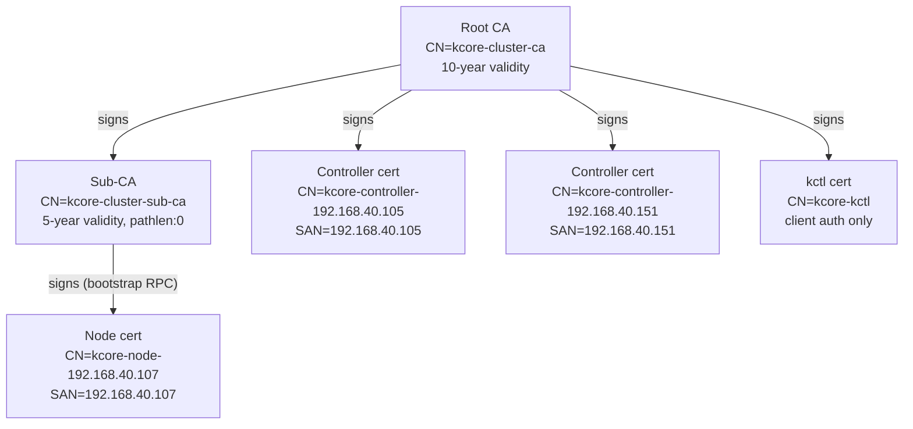
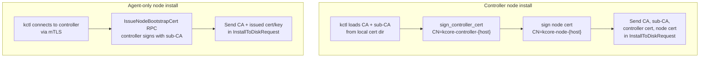

# mTLS Bootstrap and Authentication

This document explains how cluster certificates are created, how they are installed on nodes, and how mTLS is enforced between `kctl`, `kcore-controller`, and `kcore-node-agent`.

## Certificate hierarchy



Every controller gets a **unique CN** (`kcore-controller-{host}`) so replication peer identity tracking is unambiguous. Node-agent authorization uses prefix matching (`kcore-controller-`) to accept any controller in the cluster.

## 1) Certificate and CA creation

Cluster PKI is generated with:

```bash
kctl create cluster --controller <controller-host:9090> --context <name>
```

The command creates:

- `ca.crt` / `ca.key`: cluster root Certificate Authority (10-year validity)
- `sub-ca.crt` / `sub-ca.key`: intermediate sub-CA for automatic node cert renewal (5-year, pathlen:0)
- `controller.crt` / `controller.key`: controller identity with host-specific CN `kcore-controller-{host}` (server + client auth)
- `kctl.crt` / `kctl.key`: CLI client identity with CN `kcore-kctl` (client auth only)

Files are stored under `~/.kcore/<context-name>/` and the active context in `~/.kcore/config` is updated with **inline base64-encoded cert data**:

```yaml
current-context: prod
contexts:
  prod:
    controller: 192.168.40.105:9090
    controllers:
      - 192.168.40.105:9090
      - 192.168.40.151:9090
    ca-data: <base64(ca.crt PEM)>
    cert-data: <base64(kctl.crt PEM)>
    key-data: <base64(kctl.key PEM)>
```

Inline data takes precedence over file paths. No silent fallback to `~/.kcore/certs/` occurs; if no credentials are configured, `kctl` returns a clear error.

### Guard against accidental CA replacement

Running `kctl create cluster` when a context already has TLS credentials is **refused** unless `--force` is passed. This prevents silently generating a new CA that breaks connections to existing controllers.

## 2) Node install bootstrap (cert persistence)

Two install paths exist depending on whether the node will run a controller:

### Controller node (`--run-controller`)

`kctl` generates a **fresh controller certificate** for the target host using `sign_controller_cert`:

1. Loads root CA, CA key, sub-CA cert, and sub-CA key from the local cert dir.
2. Generates a controller cert with CN `kcore-controller-{node_host}` and SAN matching the host IP.
3. Generates a node cert signed by the root CA.
4. Sends CA, sub-CA, controller cert/key, and node cert/key in `InstallToDiskRequest`.

### Agent-only node (`--join-controller`)

`kctl` requests a bootstrap certificate from the target controller:

1. Connects to the primary controller via the `IssueNodeBootstrapCert` RPC.
2. The controller signs a node cert using its **sub-CA** with CN `kcore-node-{host}` and SAN = host.
3. `kctl` reads the root CA from the local cert dir and sends it along with the controller-issued node cert/key.



### Files written on the installed node

The node-agent receives cert PEM fields and writes them to `/etc/kcore/certs/`:

| File | Present on | Signed by |
|------|-----------|-----------|
| `ca.crt` | all nodes | self-signed (trust anchor) |
| `node.crt` / `node.key` | all nodes | root CA (controller install) or sub-CA (agent install) |
| `controller.crt` / `controller.key` | controller nodes | root CA |
| `sub-ca.crt` / `sub-ca.key` | controller nodes | root CA |

Before the OS install finishes, the installer copies `/etc/kcore/*` into `/mnt/etc/kcore` on the target disk. This is what persists certs across reboot into the installed KcoreOS system.

## 3) Runtime mTLS authentication

### Identity and authorization

Components authenticate each other by Common Name (CN) extracted from the client certificate:

| Component | CN pattern | Authorization check |
|-----------|-----------|---------------------|
| kctl | `kcore-kctl` | exact match |
| Controller | `kcore-controller-{host}` | prefix match `kcore-controller-` |
| Node agent | `kcore-node-{host}` | prefix match `kcore-node-` |

Prefix matching allows any controller in the cluster to call any node-agent, and controllers to authenticate to each other for replication, without pre-registering exact CNs.

### `kctl` -> `controller` and `kctl` -> `node-agent`

- `kctl` uses `https://...` unless `--insecure` is set.
- It requires CA cert + client cert + client key in secure mode.
- Server identity is validated by CA trust and SAN matching.
- Client identity is presented to server via mTLS.

### Pre-flight TLS validation

Before attempting any TLS handshake, `kctl` performs pre-flight checks on the configured credentials:

1. **CA/cert chain mismatch** -- verifies the client certificate's signature chains up to the configured CA (supports direct signing and intermediate sub-CA chains). Fails with: `"client certificate was signed by a different CA than the configured trust root"`.
2. **Expired client cert** -- checks not-after date. Fails with: `"client certificate expired on {date}"`.
3. **Expired CA cert** -- checks CA not-after date. Fails with: `"CA certificate expired on {date}"`.

These checks produce actionable error messages instead of opaque "transport error" failures.

### `controller` server and `node-agent` server

Both services support TLS config in YAML:

```yaml
tls:
  caFile: /etc/kcore/certs/ca.crt
  certFile: /etc/kcore/certs/<service>.crt
  keyFile: /etc/kcore/certs/<service>.key
```

When TLS is configured, each server:

- serves TLS with its cert/key
- requires client certificate signed by `caFile` (`client_ca_root`)

### `controller` -> `node-agent`

Controller uses the same configured CA + identity to open outbound connections to node-agent:

- secure path: `https://<node-host:9091>` with client cert
- fallback path: `http://...` only if controller TLS is not configured

### `controller` <-> `controller` (replication)

Controllers authenticate to each other using their host-specific controller certificates. The replication peer identity is derived from the connecting controller's CN (e.g., `kcore-controller-192.168.40.105`), which is used to track per-peer replication ack frontiers.

## 4) Automatic certificate renewal

Node certificates are valid for 1 year. The node-agent includes an automatic renewal client:

1. At startup and once daily, the node-agent reads its certificate from disk and checks the expiry date.
2. If the certificate expires in more than 30 days, no action is taken.
3. If within 30 days of expiry, the node-agent calls `RenewNodeCert` on the controller over the existing mTLS connection.
4. The controller verifies the node is approved, then signs a new certificate using its **sub-CA** (intermediate CA). It returns the new leaf cert + sub-CA chain PEM and a new private key.
5. The node-agent writes the renewed cert and key to disk. The new certificate takes effect on the next service restart.

The trust chain works as follows:
- `ca.crt` on each node contains only the root CA (trust anchor)
- After renewal, `node.crt` contains the leaf cert + sub-CA cert (concatenated PEM). rustls resolves the chain automatically.
- Existing root-CA-signed certs continue working. Renewals transition to sub-CA-signed certs.

### Sub-CA rotation

The operator can rotate the sub-CA at any time:

```bash
kctl rotate sub-ca
```

This generates a new sub-CA from the root CA, writes it locally, and pushes it to the controller via the `RotateSubCa` RPC. The controller hot-reloads the new sub-CA without restart. Future renewals use the new sub-CA while existing certs remain valid.

### Controller certificate rotation

```bash
kctl rotate certs --controller <new-host:port>
```

This re-signs the controller certificate with a host-specific CN and new SAN. The new cert must be deployed to the controller node and the service restarted.

## 5) Security posture and current limits

mTLS materially reduces MITM risk and blocks unauthenticated network clients from calling gRPC endpoints when TLS is enabled on both sides.

Additional security measures:

- **Node approval queue**: new nodes register as `pending` and must be approved before participating in the cluster.
- **Sub-CA auto-rotation**: node certs are renewed automatically; the sub-CA is revocable by the operator without affecting the root CA.
- **Certificate expiry visibility**: each node reports its certificate expiry at registration. `kctl get nodes` shows a `CERT EXPIRY` column with days remaining and a `⚠` warning when within 30 days of expiry.
- **Pre-flight TLS validation**: `kctl` detects CA mismatches, expired certs, and chain problems before the handshake, with actionable error messages.
- **CA replacement guard**: `kctl create cluster` refuses to silently overwrite existing PKI credentials without `--force`.

### FIPS-compatible cryptography

All TLS connections use **aws-lc-rs** as the rustls crypto backend. aws-lc-rs wraps AWS-LC, which holds FIPS 140-3 validation (certificate #4816). At process startup, each binary (controller, node-agent, kctl) installs a custom `CryptoProvider` that restricts:

- **Cipher suites**: TLS 1.3 AES-128-GCM, AES-256-GCM; TLS 1.2 ECDHE-ECDSA/RSA with AES-128-GCM and AES-256-GCM. ChaCha20-Poly1305 is excluded.
- **Key exchange groups**: secp256r1 (P-256) and secp384r1 (P-384) only. X25519 is excluded.

Certificate generation (`rcgen`) also uses aws-lc-rs instead of ring.

Remaining gaps to track:

- no CRL/OCSP revocation checks (sub-CA rotation provides a partial mitigation)
- authorization model is still coarse (transport auth is in place, fine-grained RBAC is not)

## 6) Verification checklist

- Generate PKI: `kctl create cluster --controller <controller:9090> --context prod`
- Confirm files in `~/.kcore/prod/` (including `sub-ca.crt` and `sub-ca.key`)
- Confirm `~/.kcore/config` has inline `ca-data`, `cert-data`, `key-data`
- Install node with `kctl node install ...`
- Verify installed node has `/etc/kcore/certs/*`
- Verify controller node has `/etc/kcore/certs/sub-ca.crt` and `sub-ca.key`
- Verify controller cert has host-specific CN: `openssl x509 -in /etc/kcore/certs/controller.crt -noout -subject` shows `CN=kcore-controller-{host}`
- Ensure `controller.yaml` and `node-agent.yaml` include `tls` block
- Ensure `controller.yaml` includes `subCaCertFile` and `subCaKeyFile`
- Confirm secure traffic uses HTTPS and rejects untrusted client certificates
- Confirm node-agent logs `certificate valid, no renewal needed` at startup
- Test rotation: `kctl rotate sub-ca` and verify controller logs `sub-CA rotated via kctl`
- Verify pre-flight catches deliberate mismatch (point at wrong CA): `kctl` fails with `"signed by a different CA"` before any network call
