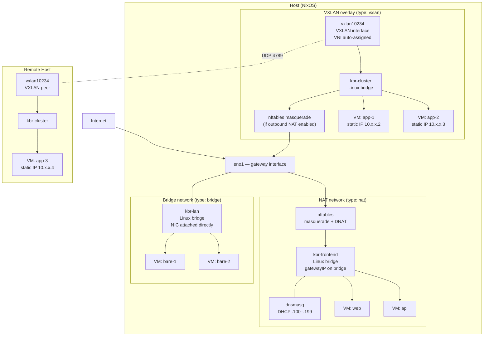

# Networking

This document covers the complete VM networking model in kcore: the three
network types, how VMs connect, how traffic flows, and every available
option.

## Network types

kcore supports three network types, each suited to different use cases:

| Type | Use case | How VMs get IPs | Internet access | Cross-host |
|------|----------|-----------------|-----------------|------------|
| **nat** (default) | Isolated VMs with outbound internet | DHCP from dnsmasq | Masquerade NAT | No |
| **bridge** | VMs on the physical LAN | DHCP from upstream network | Direct | No |
| **vxlan** | Overlay network across hosts | Controller-assigned static IPs | Optional masquerade | Yes |

## Architecture overview



## NAT network (default)

The default and most common mode. Each VM receives an IP via DHCP from a
local dnsmasq instance. Outbound traffic is masqueraded through the host's
gateway interface. Inbound traffic uses DNAT for port forwarding.

**What gets created:**

| Component | Name | Purpose |
|-----------|------|---------|
| Linux bridge | `kbr-<name>` | L2 switch connecting all VMs |
| Gateway IP | assigned to bridge | Default route for guests |
| DHCP server | dnsmasq on `kbr-<name>` | Assigns IPs in `.100`–`.199` range |
| nftables table | `ip kcore-<name>` | Masquerade + DNAT rules |
| VLAN sub-interface | `eno1.<id>` | Only when `vlanId > 0` |

**Traffic flow:**

```
Outbound:  VM → TAP → kbr-<net> → nftables masquerade → eno1 → internet
Inbound:   internet → eno1 → nftables DNAT → kbr-<net> → VM
VM↔VM:     same bridge = direct L2, different bridge = no path
```

## Bridge network

The bridge attaches the host's physical NIC (or VLAN sub-interface)
directly to the Linux bridge. VMs appear on the physical LAN and receive
IPs from the upstream DHCP server. No local DHCP, no masquerade, no DNAT.

**What gets created:**

| Component | Name | Purpose |
|-----------|------|---------|
| Linux bridge | `kbr-<name>` | L2 switch connecting VMs + physical NIC |
| Physical NIC enslaved | `eno1` (or `eno1.<vlanId>`) | Attached to bridge as port |

**What is NOT created:**

- No dnsmasq (VMs use upstream DHCP)
- No nftables rules (no NAT, no DNAT)
- No gateway IP on bridge (bridge is a transparent L2 device)

**Traffic flow:**

```
Outbound:  VM → TAP → kbr-<net> → eno1 → upstream network
Inbound:   upstream → eno1 → kbr-<net> → VM (VM has real LAN IP)
VM↔VM:     direct L2 through bridge
```

**Warning:** Enslaving the host's primary NIC to a bridge may disrupt the
host's own connectivity if not planned carefully (e.g., if the host's IP
is on that NIC). Use a dedicated NIC or VLAN sub-interface.

## VXLAN overlay network

VXLAN creates a Layer 2 overlay across multiple hosts using UDP
encapsulation (port 4789). The controller acts as the control plane:
it auto-assigns a VNI (VXLAN Network Identifier) from the network name,
manages static IP allocation for VMs, and configures FDB entries for
peer discovery.

**What gets created:**

| Component | Name | Purpose |
|-----------|------|---------|
| Linux bridge | `kbr-<name>` | L2 switch for local VMs |
| VXLAN interface | `vxlan<VNI>` | UDP tunnel endpoint |
| FDB entries | per peer node | Static flooding to peer hosts |
| nftables masquerade | (optional) | Only if outbound NAT enabled |
| Static IP | via cloud-init | Controller-assigned, no DHCP |

**What is NOT created:**

- No dnsmasq (IPs are static, assigned by controller)
- No DNAT rules

**Traffic flow:**

```
VM↔VM (same host):   VM → TAP → kbr-<net> → TAP → VM  (local L2)
VM↔VM (cross-host):  VM → TAP → kbr-<net> → vxlan<VNI> → UDP 4789 → remote host
Outbound (optional): VM → TAP → kbr-<net> → nftables masquerade → eno1 → internet
```

**VNI assignment:** The controller computes a deterministic VNI from the
network name using a hash function (range 10000–15999). Networks with the
same name on different nodes get the same VNI, enabling cross-host L2
connectivity.

**Static IP allocation:** The controller maintains a `next_ip` counter
per network. When a VM is created on a VXLAN network, the controller
allocates the next available IP (starting at `.2`) and injects it into
the VM's cloud-init network config. IPs are currently not reclaimed on
VM deletion (monotonic allocation).

**Peer discovery:** When the controller pushes config to a node, it
identifies all other nodes hosting the same VXLAN network (by name) and
generates FDB entries so each node knows where to send unknown-destination
frames.

## Network options (Nix)

Defined in `modules/ch-vm/options.nix` under `ch-vm.vms.networks.<name>`:

| Option | Type | Default | Applies to | Description |
|--------|------|---------|-----------|-------------|
| `externalIP` | string | *required* | all | Public-facing IP (NAT/DNAT for nat; informational for others) |
| `gatewayIP` | string | *required* | all | IP assigned to the bridge (nat) or subnet base (vxlan) |
| `internalNetmask` | string | `255.255.255.0` | all | Subnet mask |
| `networkType` | enum | `"nat"` | all | `"nat"`, `"bridge"`, or `"vxlan"` |
| `enableOutboundNat` | bool | `true` | vxlan | Whether to add masquerade rules for internet access |
| `vni` | int | `0` | vxlan | VXLAN Network Identifier (auto-assigned by controller) |
| `vxlanPeers` | list of string | `[]` | vxlan | IP addresses of peer hosts |
| `vxlanLocalIp` | string | `""` | vxlan | This host's IP for VXLAN endpoint |
| `allowedTCPPorts` | list of port | `[]` | nat | TCP ports to DNAT from `externalIP` |
| `allowedUDPPorts` | list of port | `[]` | nat | UDP ports to DNAT from `externalIP` |
| `vlanId` | int | `0` | nat, bridge | 802.1Q VLAN tag (0 = no VLAN) |

Global options under `ch-vm.vms`:

| Option | Type | Default | Description |
|--------|------|---------|-------------|
| `gatewayInterface` | string | *required* | Host NIC used as upstream (e.g. `eno1`) |
| `networks` | attrset | `{}` | Named networks |

## VM network options (Nix)

Per-VM options under `ch-vm.vms.virtualMachines.<name>`:

| Option | Type | Default | Description |
|--------|------|---------|-------------|
| `network` | string | `"default"` | Network name (must match a key in `networks`) |
| `macAddress` | null or string | `null` | Manual MAC; auto-generated from VM name if null |
| `cloudInitNetworkConfigFile` | null or path | `null` | Custom cloud-init network config (overrides default) |

## How VMs get network connectivity

### MAC address generation

When `macAddress` is null (the default), kcore generates a deterministic MAC
from the VM name using SHA-256:

```
52:54:00:<byte0>:<byte1>:<byte2>
```

The `52:54:00` prefix is the standard KVM/QEMU locally administered OUI.
The remaining bytes come from `builtins.hashString "sha256" vmName`, so the
same VM name always produces the same MAC. This is defined in
`modules/ch-vm/helpers.nix`.

### TAP interface naming

TAP names are also deterministic: `tap-` followed by the first 8 hex
characters of `SHA-256(vmName)`. This avoids collisions and keeps names
stable across rebuilds.

### Cloud-init network config

For **nat** and **bridge** networks (DHCP-based), each VM gets:

```yaml
version: 2
ethernets:
  vmnic0:
    match:
      macaddress: "52:54:00:xx:xx:xx"
    set-name: eth0
    dhcp4: true
```

For **vxlan** networks (static IP), the controller generates:

```yaml
version: 2
ethernets:
  vmnic0:
    match:
      macaddress: "52:54:00:xx:xx:xx"
    set-name: eth0
    addresses:
      - 10.240.0.2/24
    routes:
      - to: 0.0.0.0/0
        via: 10.240.0.1
    nameservers:
      addresses:
        - 1.1.1.1
        - 8.8.8.8
```

### Cloud-init user config

By default, a `kcore` user is created with password `kcore` and password
auth enabled. When SSH keys are attached to the VM (via `kctl create vm
--ssh-key`), the controller generates a cloud-init config with
`ssh_authorized_keys`, `lock_passwd: true`, and `ssh_pwauth: false` instead.

### Boot sequence (systemd ordering)

```
kcore-bridge-<net>  →  kcore-dhcp-<net>  (nat only)
                    →  kcore-tap-<vm>  →  kcore-vm-<vm>
```

1. Bridge service creates the bridge and configures it based on network type
2. DHCP service starts dnsmasq on the bridge (nat only; skipped for bridge/vxlan)
3. TAP service creates the TAP device and attaches it to the bridge
4. VM service starts Cloud Hypervisor with `--net tap=<tap>,mac=<mac>`

## DHCP configuration (nat only)

Each NAT network runs its own dnsmasq instance:

| Setting | Value |
|---------|-------|
| Interface | `kbr-<name>` |
| DHCP range | `<gatewayIP-prefix>.100` – `.199` |
| Lease time | 12 hours |
| Router (option 3) | `gatewayIP` |
| DNS (option 6) | `1.1.1.1`, `8.8.8.8` |
| Lease file | `/run/kcore/dnsmasq-<name>.leases` |

The DHCP range is derived from the first three octets of `gatewayIP`.
For example, if `gatewayIP = 10.240.0.1`, the range is `10.240.0.100` to
`10.240.0.199`, supporting up to 100 VMs per network.

Bridge and VXLAN networks do not run dnsmasq.

## VLAN support (802.1Q)

When a network (nat or bridge type) has `vlanId > 0`, kcore creates a
VLAN sub-interface on the host's `gatewayInterface`:

```
eno1  ──┬── eno1.100  ── (network "prod", VLAN 100)
        ├── eno1.200  ── (network "staging", VLAN 200)
        └── (untagged traffic for non-VLAN networks)
```

VMs see plain untagged ethernet. The VLAN sub-interface is created and
destroyed with the bridge service.

VLANs are fully optional. When `vlanId = 0` (the default), the bridge
uses `gatewayInterface` directly.

## Disabling VXLAN

Nodes can be installed with `--disable-vxlan` to prevent VXLAN network
creation. This is useful for simple deployments that only need NAT or
bridged networking.

When `--disable-vxlan` is passed during `kctl node install`:

1. The install script creates a `/etc/kcore/disable-vxlan` marker file
2. On startup, the node-agent reads this marker and reports
   `disable_vxlan = true` in its registration with the controller
3. The controller stores this flag in the `nodes` table
4. Any attempt to create a VXLAN network targeting that node returns
   `FailedPrecondition: VXLAN is disabled on node '<id>'`

NAT and bridge networks remain fully functional on nodes with VXLAN
disabled.

## Safety guards

### Subnet overlap protection

Before creating a bridge, the service checks whether the `gatewayIP`
subnet overlaps with the host's IP on `gatewayInterface`. If the first
three octets match, the bridge creation is refused to prevent hijacking
the host's LAN connectivity.

### Network validation

The controller validates all network parameters before storing them:

- Network name must match `[A-Za-z0-9_-]+` and cannot be `default`
- `externalIP` and `gatewayIP` must be valid IPv4 addresses
- `internalNetmask` must be a supported CIDR-equivalent mask
- `vlanId` must be 0–4094
- `networkType` must be `nat`, `bridge`, or `vxlan` (defaults to `nat`)
- VXLAN networks cannot be created on nodes with `disable_vxlan = true`

### Firewall

All `kbr-*` interfaces are added to NixOS `trustedInterfaces`, meaning
traffic on bridges is not filtered by the NixOS firewall. East-west
traffic between VMs on the same network is unrestricted.

UDP port 4789 is opened in the firewall when any VXLAN network is
configured on the node.

## kctl commands

### Create a network

```bash
kctl create network <name> \
  --external-ip <ip> \
  --gateway-ip <ip> \
  [--internal-netmask <mask>] \
  [--type <nat|bridge|vxlan>] \
  [--vlan-id <id>] \
  [--no-outbound-nat] \
  [--target-node <node-addr-or-id>]
```

| Flag | Required | Default | Description |
|------|----------|---------|-------------|
| `<name>` | yes | — | Network name (positional argument) |
| `--external-ip` | yes | — | Public IP for NAT/DNAT |
| `--gateway-ip` | yes | — | Bridge gateway IP (host-side) |
| `--internal-netmask` | no | `255.255.255.0` | Subnet mask |
| `--type` | no | `nat` | Network type: `nat`, `bridge`, or `vxlan` |
| `--vlan-id` | no | `0` | 802.1Q VLAN tag (0 = no VLAN) |
| `--no-outbound-nat` | no | `false` | Disable masquerade (only meaningful for vxlan) |
| `--target-node` | no | auto-selected | Node address or ID |

**Examples:**

```bash
# NAT network (default type)
kctl create network frontend \
  --external-ip 203.0.113.10 \
  --gateway-ip 10.240.10.1

# Bridge network — VMs get IPs from upstream DHCP
kctl create network lan \
  --type bridge \
  --external-ip 192.168.1.100 \
  --gateway-ip 192.168.1.1

# Bridge network on VLAN 100
kctl create network prod-lan \
  --type bridge \
  --external-ip 10.100.0.1 \
  --gateway-ip 10.100.0.1 \
  --vlan-id 100

# VXLAN overlay with outbound NAT (default)
kctl create network cluster \
  --type vxlan \
  --external-ip 203.0.113.10 \
  --gateway-ip 10.250.0.1

# VXLAN overlay without outbound NAT (isolated)
kctl create network internal \
  --type vxlan \
  --external-ip 203.0.113.10 \
  --gateway-ip 10.251.0.1 \
  --no-outbound-nat

# NAT network on VLAN 200
kctl create network staging \
  --external-ip 198.51.100.5 \
  --gateway-ip 10.200.0.1 \
  --vlan-id 200 \
  --target-node node-1
```

### List networks

```bash
kctl get networks [--target-node <node-addr-or-id>]
```

Output:

```
NAME          TYPE    GATEWAY         NETMASK           EXTERNAL_IP      VLAN  NODE
frontend      nat     10.240.10.1     255.255.255.0     203.0.113.10        -  node-1
lan           bridge  192.168.1.1     255.255.255.0     192.168.1.100       -  node-1
cluster       vxlan   10.250.0.1      255.255.255.0     203.0.113.10        -  node-1
cluster       vxlan   10.250.0.1      255.255.255.0     203.0.113.11        -  node-2
```

Without `--target-node`, lists networks from all nodes.

### Delete a network

```bash
kctl delete network <name> [--target-node <node-addr-or-id>]
```

- Fails if any VM is still attached to the network
- `--target-node` is required when the same network name exists on
  multiple nodes
- Cannot delete the `default` network

### Install a node with VXLAN disabled

```bash
kctl node install \
  --os-disk /dev/sda \
  --join-controller 192.168.1.10:9090 \
  --disable-vxlan \
  --certs-dir ./certs
```

The `--disable-vxlan` flag is passed to the install-to-disk script, which
writes a marker file. The node-agent reads this on startup and reports it
during registration.

### Create a VM on a specific network

```bash
kctl create vm web-01 \
  --image https://cloud.debian.org/images/cloud/bookworm/latest/debian-12-genericcloud-amd64.raw \
  --image-sha256 abc123... \
  --network frontend \
  --cpu 2 \
  --memory 2G \
  --ssh-key mykey
```

The `--network` flag references a network by name. If omitted, the VM
is placed on the `default` network.

For VXLAN networks, the controller automatically allocates a static IP
and generates a cloud-init network config with that IP. The allocated IP
is visible in `kctl get vm <name>`.

## The default network

The `default` network is special:

- It is **not** stored in the `networks` database table
- It comes from the controller's configuration file (`defaultNetwork`)
- It is always rendered in the generated Nix config as type `nat`
- It cannot be created, deleted, or modified via `kctl create network`
- Port forwarding is not available on the default network through the API

Controller config example (`/etc/kcore/controller.yaml`):

```yaml
defaultNetwork:
  gatewayInterface: eno1
  externalIp: 203.0.113.10
  gatewayIp: 10.240.0.1
  internalNetmask: 255.255.255.0
```

## Generated Nix configuration

When the controller pushes config to a node, `nixgen` produces a NixOS
configuration. Here is an example with all three network types:

```nix
{ pkgs, ... }: {
  ch-vm.vms = {
    enable = true;
    cloudHypervisorPackage = pkgs.cloud-hypervisor;
    gatewayInterface = "eno1";

    networks.default = {
      externalIP = "203.0.113.10";
      gatewayIP = "10.240.0.1";
    };

    networks."frontend" = {
      externalIP = "203.0.113.10";
      gatewayIP = "10.240.10.1";
      allowedTCPPorts = [ 80 443 ];
    };

    networks."lan" = {
      externalIP = "192.168.1.100";
      gatewayIP = "192.168.1.1";
      networkType = "bridge";
    };

    networks."cluster" = {
      externalIP = "203.0.113.10";
      gatewayIP = "10.250.0.1";
      networkType = "vxlan";
      vni = 10234;
      vxlanPeers = [ "192.168.40.106" ];
      vxlanLocalIp = "192.168.40.105";
    };

    virtualMachines."web-01" = {
      image = "/var/lib/kcore/images/debian.raw";
      imageFormat = "raw";
      cores = 2;
      memorySize = 2048;
      network = "frontend";
      autoStart = true;
    };

    virtualMachines."bare-1" = {
      image = "/var/lib/kcore/images/debian.raw";
      imageFormat = "raw";
      cores = 2;
      memorySize = 2048;
      network = "lan";
      autoStart = true;
    };

    virtualMachines."app-1" = {
      image = "/var/lib/kcore/images/debian.raw";
      imageFormat = "raw";
      cores = 2;
      memorySize = 2048;
      network = "cluster";
      autoStart = true;
      cloudInitNetworkConfigFile = pkgs.writeText "app-1-net.yaml" ''
        version: 2
        ethernets:
          vmnic0:
            match:
              macaddress: "52:54:00:ab:cd:ef"
            set-name: eth0
            addresses:
              - 10.250.0.2/24
            routes:
              - to: 0.0.0.0/0
                via: 10.250.0.1
            nameservers:
              addresses:
                - 1.1.1.1
                - 8.8.8.8
      '';
    };
  };
}
```

This results in the following systemd services on the node:

```
kcore-bridge-default.service     # NAT bridge (10.240.0.1/24) + masquerade
kcore-dhcp-default.service       # DHCP on kbr-default
kcore-bridge-frontend.service    # NAT bridge (10.240.10.1/24) + masquerade + DNAT 80,443
kcore-dhcp-frontend.service      # DHCP on kbr-frontend
kcore-bridge-lan.service         # Bridge mode — eno1 enslaved to kbr-lan
kcore-bridge-cluster.service     # VXLAN: creates vxlan10234, FDB entries, kbr-cluster
kcore-tap-web-01.service         # TAP → kbr-frontend
kcore-vm-web-01.service          # Cloud Hypervisor for web-01
kcore-tap-bare-1.service         # TAP → kbr-lan
kcore-vm-bare-1.service          # Cloud Hypervisor for bare-1
kcore-tap-app-1.service          # TAP → kbr-cluster
kcore-vm-app-1.service           # Cloud Hypervisor for app-1 (static IP)
```

## Database schema

### `networks` table

| Column | Type | Default | Description |
|--------|------|---------|-------------|
| `name` | TEXT | PK (with node_id) | Network name |
| `external_ip` | TEXT | — | Public-facing IP |
| `gateway_ip` | TEXT | — | Bridge gateway address |
| `internal_netmask` | TEXT | `255.255.255.0` | Subnet mask |
| `allowed_tcp_ports` | TEXT | `''` | Comma-separated TCP ports for DNAT |
| `allowed_udp_ports` | TEXT | `''` | Comma-separated UDP ports for DNAT |
| `vlan_id` | INTEGER | `0` | 802.1Q VLAN tag |
| `network_type` | TEXT | `'nat'` | `nat`, `bridge`, or `vxlan` |
| `enable_outbound_nat` | INTEGER | `1` | Whether masquerade is enabled (0/1) |
| `vni` | INTEGER | `0` | VXLAN Network Identifier |
| `next_ip` | INTEGER | `2` | Next IP to allocate for VXLAN VMs |
| `node_id` | TEXT | PK (with name), FK → nodes | |

### `vms` table (network-related columns)

| Column | Type | Default | Description |
|--------|------|---------|-------------|
| `vm_ip` | TEXT | `''` | Controller-assigned static IP (VXLAN only) |

### `nodes` table (network-related columns)

| Column | Type | Default | Description |
|--------|------|---------|-------------|
| `disable_vxlan` | INTEGER | `0` | When non-zero, VXLAN networks cannot be created on this node |

Networks are scoped per-node. The same network name on two different
nodes creates two independent bridges — but for VXLAN, same-name
networks share a VNI, enabling cross-host connectivity.

## Limitations

- **Single NIC per VM**: Cloud Hypervisor is invoked with one `--net`
  argument. Multi-homed VMs are not supported through the kcore API.
- **IPv4 only**: All validation and configuration is IPv4. No IPv6 support.
- **DNAT targets the bridge gateway**: Port forwarding (nat only) sends
  traffic to `gatewayIP`, not to a specific VM IP.
- **No east-west firewall**: VMs on the same bridge can freely
  communicate. There is no micro-segmentation within a network.
- **Fixed DNS**: All VMs get `1.1.1.1` and `8.8.8.8`.
- **DHCP range**: Fixed `.100`–`.199` range (100 VMs per NAT network).
- **VXLAN IP allocation is monotonic**: IPs allocated for VXLAN VMs are
  not reclaimed when VMs are deleted. The `next_ip` counter only
  increments.
- **VXLAN peer discovery is push-based**: Peer FDB entries are updated
  during `push_config_to_node`. Adding a new node to an existing VXLAN
  network requires the controller to re-push configs to all participating
  nodes.
- **Port forwarding not exposed in kctl**: The `--allowed-tcp-ports` and
  `--allowed-udp-ports` fields exist in the proto API but are not yet
  wired to kctl flags.
