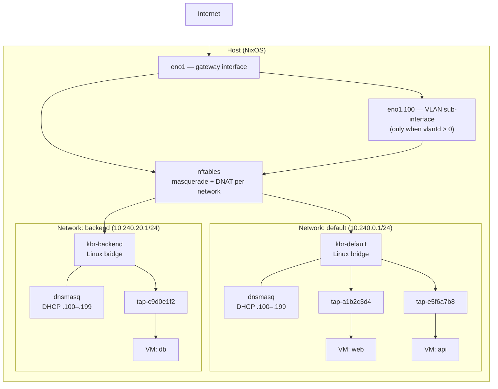

# Networking

This document covers the complete VM networking model in kcore: how
networks are created, how VMs connect, how traffic flows, and every
available option.

## Architecture overview



Each **network** creates:

| Component | Name | Purpose |
|-----------|------|---------|
| Linux bridge | `kbr-<name>` | L2 switch connecting all VMs on this network |
| DHCP server | dnsmasq on `kbr-<name>` | Assigns IPs to VMs (`.100`–`.199` range) |
| nftables table | `ip kcore-<name>` | Masquerade (outbound NAT) + DNAT (port forwarding) |
| VLAN sub-interface | `eno1.<id>` | Only when `vlanId > 0`; upstream tagged trunk |

Each **VM** creates:

| Component | Name | Purpose |
|-----------|------|---------|
| TAP interface | `tap-<8-hex-chars>` | Virtual ethernet port for the VM |
| Cloud Hypervisor | `kcore-vm-<name>` | VM process using `--net tap=...,mac=...` |
| Cloud-init seed ISO | `/etc/kcore/seeds/<name>.iso` | Hostname, users, DHCP network config |

## Network options (Nix)

Defined in `modules/ch-vm/options.nix` under `ch-vm.vms.networks.<name>`:

| Option | Type | Default | Description |
|--------|------|---------|-------------|
| `externalIP` | string | *required* | Public-facing IP used in NAT and DNAT rules |
| `gatewayIP` | string | *required* | IP assigned to the bridge on the host (default route for guests) |
| `internalNetmask` | string | `255.255.255.0` | Subnet mask for the bridge network |
| `allowedTCPPorts` | list of port | `[]` | TCP ports to DNAT from `externalIP` to `gatewayIP` |
| `allowedUDPPorts` | list of port | `[]` | UDP ports to DNAT from `externalIP` to `gatewayIP` |
| `vlanId` | int | `0` | 802.1Q VLAN tag; when > 0, bridge sits on a VLAN sub-interface |

Global options under `ch-vm.vms`:

| Option | Type | Default | Description |
|--------|------|---------|-------------|
| `gatewayInterface` | string | *required* | Host NIC used as upstream (e.g. `eno1`) |
| `networks` | attrset | `{}` | Named networks, each backed by a bridge with NAT |

## VM network options (Nix)

Per-VM options under `ch-vm.vms.virtualMachines.<name>`:

| Option | Type | Default | Description |
|--------|------|---------|-------------|
| `network` | string | `"default"` | Network name (must match a key in `networks`) |
| `macAddress` | null or string | `null` | Manual MAC; auto-generated from VM name if null |
| `cloudInitNetworkConfigFile` | null or path | `null` | Custom cloud-init network config (overrides default DHCP) |

## How VMs get network connectivity

### MAC address generation

When `macAddress` is null (the default), kcore generates a deterministic MAC
from the VM name using SHA-256:

```
52:54:00:<byte0>:<byte1>:<byte2>
```

The `52:54:00` prefix is the standard KVM/QEMU locally administered OUI.
The remaining bytes come from `builtins.hashString "sha256" vmName`, so the
same VM name always produces the same MAC. This is defined in
`modules/ch-vm/helpers.nix`.

### TAP interface naming

TAP names are also deterministic: `tap-` followed by the first 8 hex
characters of `SHA-256(vmName)`. This avoids collisions and keeps names
stable across rebuilds.

### Cloud-init network config

Unless overridden by `cloudInitNetworkConfigFile`, each VM gets a default
cloud-init network config:

```yaml
version: 2
ethernets:
  vmnic0:
    match:
      macaddress: "52:54:00:xx:xx:xx"
    set-name: eth0
    dhcp4: true
```

This matches the auto-generated MAC, renames the interface to `eth0`, and
enables DHCPv4. The DHCP server on the bridge hands out an IP, default
route (= `gatewayIP`), and DNS servers (`1.1.1.1`, `8.8.8.8`).

### Cloud-init user config

By default, a `kcore` user is created with password `kcore` and password
auth enabled. When SSH keys are attached to the VM (via `kctl create vm
--ssh-key`), the controller generates a cloud-init config with
`ssh_authorized_keys`, `lock_passwd: true`, and `ssh_pwauth: false` instead.

### Boot sequence (systemd ordering)

```
kcore-bridge-<net>  →  kcore-dhcp-<net>
                    →  kcore-tap-<vm>  →  kcore-vm-<vm>
```

1. Bridge service creates the bridge, assigns the gateway IP, sets up nftables
2. DHCP service starts dnsmasq on the bridge
3. TAP service creates the TAP device and attaches it to the bridge
4. VM service starts Cloud Hypervisor with `--net tap=<tap>,mac=<mac>`

## Traffic flow

### Outbound (VM → internet)

```
VM eth0 → TAP → kbr-<net> → nftables masquerade → eno1 (or eno1.<vlan>) → internet
```

nftables rule:
```
table ip kcore-<net> {
  chain postrouting {
    type nat hook postrouting priority srcnat;
    oifname "eno1" masquerade
  }
}
```

When `vlanId > 0`, `oifname` is `eno1.<vlanId>` instead of `eno1`.

### Inbound (internet → VM via DNAT)

Only ports listed in `allowedTCPPorts` / `allowedUDPPorts` are forwarded.
Traffic arriving on `externalIP:port` is DNAT'd to `gatewayIP:port`:

```
internet → eno1 → nftables DNAT → kbr-<net> (gatewayIP) → VM
```

nftables rules (for each port):
```
chain prerouting {
  type nat hook prerouting priority dstnat;
  ip daddr <externalIP> tcp dport <port> dnat to <gatewayIP>
}
chain forward {
  type filter hook forward priority 0;
  iifname "eno1" tcp dport <port> accept
}
```

### VM ↔ VM (same network)

VMs on the same bridge communicate directly at L2 — no NAT involved.
The bridge acts as a virtual switch.

### VM ↔ VM (different networks)

VMs on different bridges have no direct path. Traffic would need to be
routed through the host (if the host has routes) or through an external
router. By default, there is no inter-network routing configured.

## DHCP configuration

Each network runs its own dnsmasq instance:

| Setting | Value |
|---------|-------|
| Interface | `kbr-<name>` |
| DHCP range | `<gatewayIP-prefix>.100` – `.199` |
| Lease time | 12 hours |
| Router (option 3) | `gatewayIP` |
| DNS (option 6) | `1.1.1.1`, `8.8.8.8` |
| Lease file | `/run/kcore/dnsmasq-<name>.leases` |

The DHCP range is derived from the first three octets of `gatewayIP`.
For example, if `gatewayIP = 10.240.0.1`, the range is `10.240.0.100` to
`10.240.0.199`, supporting up to 100 VMs per network.

## VLAN support (802.1Q)

When a network has `vlanId > 0`, kcore creates a VLAN sub-interface on
the host's `gatewayInterface` before setting up the bridge:

```
eno1  ──┬── eno1.100  ── (masquerade/DNAT for network "prod")
        ├── eno1.200  ── (masquerade/DNAT for network "staging")
        └── (untagged traffic for non-VLAN networks)
```

This is "Use Case A" VLAN tagging — the host handles the tags, and VMs
see plain untagged ethernet. The VLAN sub-interface is created and
destroyed with the bridge service.

VLANs are fully optional. When `vlanId = 0` (the default), the bridge
uses `gatewayInterface` directly — identical to pre-VLAN behavior.

### VLAN setup sequence

1. `ip link add link eno1 name eno1.100 type vlan id 100`
2. `ip link set eno1.100 up`
3. Bridge `kbr-prod` is created normally
4. Masquerade: `oifname "eno1.100" masquerade`
5. DNAT forward: `iifname "eno1.100" ... accept`

On stop, the VLAN sub-interface is cleaned up:
`ip link delete eno1.100`

## Safety guards

### Subnet overlap protection

Before creating a bridge, the service checks whether the `gatewayIP`
subnet overlaps with the host's IP on `gatewayInterface`. If the first
three octets match, the bridge creation is refused to prevent hijacking
the host's LAN connectivity.

### Network validation

The controller validates all network parameters before storing them:

- Network name must match `[A-Za-z0-9_-]+` and cannot be `default`
- `externalIP` and `gatewayIP` must be valid IPv4 addresses
- `internalNetmask` must be a supported CIDR-equivalent mask
- `vlanId` must be 0–4094

### Firewall

All `kbr-*` interfaces are added to NixOS `trustedInterfaces`, meaning
traffic on bridges is not filtered by the NixOS firewall. East-west
traffic between VMs on the same network is unrestricted.

## kctl commands

### Create a network

```bash
kctl create network <name> \
  --external-ip <ip> \
  --gateway-ip <ip> \
  [--internal-netmask <mask>] \
  [--vlan-id <id>] \
  [--target-node <node-addr-or-id>]
```

| Flag | Required | Default | Description |
|------|----------|---------|-------------|
| `<name>` | yes | — | Network name (positional argument) |
| `--external-ip` | yes | — | Public IP for NAT/DNAT |
| `--gateway-ip` | yes | — | Bridge gateway IP (host-side) |
| `--internal-netmask` | no | `255.255.255.0` | Subnet mask |
| `--vlan-id` | no | `0` | 802.1Q VLAN tag (0 = no VLAN) |
| `--target-node` | no | auto-selected | Node address or ID |

Examples:

```bash
# Simple network (no VLAN)
kctl create network frontend \
  --external-ip 203.0.113.10 \
  --gateway-ip 10.240.10.1

# Network on VLAN 100
kctl create network production \
  --external-ip 198.51.100.5 \
  --gateway-ip 10.100.0.1 \
  --vlan-id 100 \
  --target-node node-1

# Network with smaller subnet
kctl create network mgmt \
  --external-ip 203.0.113.10 \
  --gateway-ip 10.240.30.1 \
  --internal-netmask 255.255.255.128
```

The controller stores the network in the database and pushes a
`nixos-rebuild` to the target node, which brings up the bridge, DHCP,
and nftables rules.

### List networks

```bash
kctl get networks [--target-node <node-addr-or-id>]
```

Output:

```
NAME                  GATEWAY           NETMASK           EXTERNAL_IP      VLAN  NODE
frontend              10.240.10.1       255.255.255.0     203.0.113.10        -  node-1
production            10.100.0.1        255.255.255.0     198.51.100.5      100  node-1
```

Without `--target-node`, lists networks from all nodes.

### Delete a network

```bash
kctl delete network <name> [--target-node <node-addr-or-id>]
```

- Fails if any VM is still attached to the network
- `--target-node` is required when the same network name exists on
  multiple nodes
- Cannot delete the `default` network

### Create a VM on a specific network

```bash
kctl create vm web-01 \
  --image https://cloud.debian.org/images/cloud/bookworm/latest/debian-12-genericcloud-amd64.raw \
  --image-sha256 abc123... \
  --network frontend \
  --cpu 2 \
  --memory 2G \
  --ssh-key mykey
```

The `--network` flag references a network by name. If omitted, the VM
is placed on the `default` network. Non-default networks must exist on
the target node before the VM is created.

## The default network

The `default` network is special:

- It is **not** stored in the `networks` database table
- It comes from the controller's configuration file (`defaultNetwork`)
- It is always rendered in the generated Nix config
- It cannot be created, deleted, or modified via `kctl create network`
- Port forwarding is not available on the default network through the API

Controller config example (`/etc/kcore/controller.yaml`):

```yaml
defaultNetwork:
  gatewayInterface: eno1
  externalIp: 203.0.113.10
  gatewayIp: 10.240.0.1
  internalNetmask: 255.255.255.0
```

## Generated Nix configuration

When the controller pushes config to a node, `nixgen` produces a complete
NixOS configuration. Here is an example with two networks and two VMs:

```nix
{ pkgs, ... }: {
  ch-vm.vms = {
    enable = true;
    cloudHypervisorPackage = pkgs.cloud-hypervisor;
    gatewayInterface = "eno1";

    networks.default = {
      externalIP = "203.0.113.10";
      gatewayIP = "10.240.0.1";
    };

    networks."production" = {
      externalIP = "198.51.100.5";
      gatewayIP = "10.100.0.1";
      allowedTCPPorts = [ 80 443 ];
      vlanId = 100;
    };

    virtualMachines."web-01" = {
      image = "/var/lib/kcore/images/aaa...-debian.raw";
      imageFormat = "raw";
      cores = 2;
      memorySize = 2048;
      network = "production";
      autoStart = true;
      cloudInitUserConfigFile = pkgs.writeText "web-01-cloud-init.yaml" "#cloud-config
hostname: web-01
users:
  - default
  - name: kcore
    gecos: kcore default user
    groups: [sudo]
    shell: /bin/bash
    lock_passwd: true
    ssh_authorized_keys:
      - \"ssh-rsa AAAA... user@host\"
ssh_pwauth: false
";
    };

    virtualMachines."db-01" = {
      image = "/var/lib/kcore/images/bbb...-debian.raw";
      imageFormat = "raw";
      cores = 4;
      memorySize = 4096;
      network = "default";
      autoStart = true;
    };
  };
}
```

This results in the following systemd services on the node:

```
kcore-bridge-default.service     # Bridge kbr-default (10.240.0.1/24)
kcore-dhcp-default.service       # DHCP on kbr-default
kcore-bridge-production.service  # VLAN eno1.100 + bridge kbr-production (10.100.0.1/24)
kcore-dhcp-production.service    # DHCP on kbr-production
kcore-tap-web-01.service         # TAP → kbr-production
kcore-vm-web-01.service          # Cloud Hypervisor for web-01
kcore-tap-db-01.service          # TAP → kbr-default
kcore-vm-db-01.service           # Cloud Hypervisor for db-01
```

## Database schema

Networks are stored in the `networks` table:

| Column | Type | Default | Description |
|--------|------|---------|-------------|
| `name` | TEXT | PK (with node_id) | Network name |
| `external_ip` | TEXT | — | Public-facing IP for NAT/DNAT |
| `gateway_ip` | TEXT | — | Bridge gateway address |
| `internal_netmask` | TEXT | `255.255.255.0` | Subnet mask |
| `allowed_tcp_ports` | TEXT | `''` | Comma-separated TCP ports for DNAT |
| `allowed_udp_ports` | TEXT | `''` | Comma-separated UDP ports for DNAT |
| `vlan_id` | INTEGER | `0` | 802.1Q VLAN tag |
| `node_id` | TEXT | PK (with name), FK → nodes | |

Networks are scoped per-node. The same network name on two different
nodes creates two independent bridges.

## Limitations

- **Single NIC per VM**: Cloud Hypervisor is invoked with one `--net`
  argument. Multi-homed VMs are not supported through the kcore API.
- **IPv4 only**: All validation and configuration is IPv4. No IPv6 support.
- **DNAT targets the bridge gateway**: Port forwarding sends traffic to
  `gatewayIP` (the host bridge address), not to a specific VM IP. For
  single-VM-per-network setups this works; for multi-VM networks, the
  guest receiving the traffic depends on host routing.
- **No east-west firewall**: VMs on the same bridge can freely
  communicate. There is no micro-segmentation within a network.
- **Fixed DNS**: All VMs get `1.1.1.1` and `8.8.8.8`. No cluster-internal
  DNS is configured.
- **DHCP range**: Fixed `.100`–`.199` range (100 VMs per network).
- **Port forwarding not exposed in kctl**: The `--allowed-tcp-ports` and
  `--allowed-udp-ports` fields exist in the proto API but are not yet
  wired to kctl flags.
