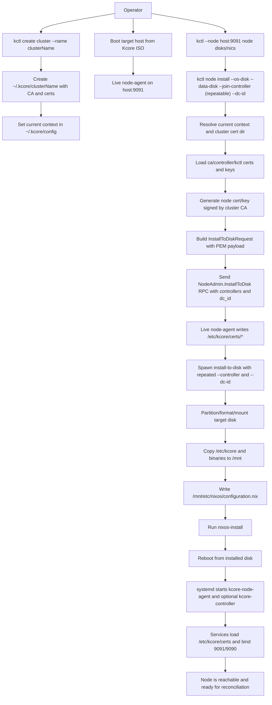
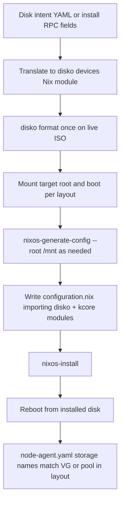
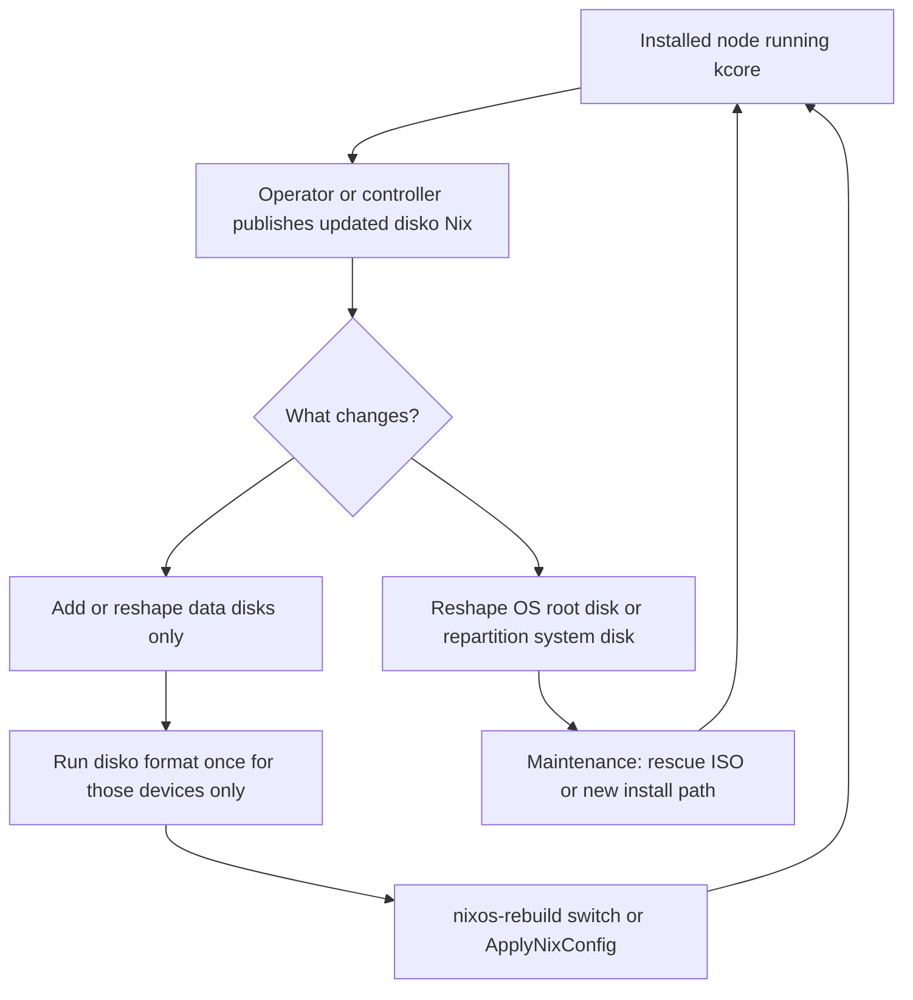

# Node Install Bootstrap Flow

This document defines the node installation procedure with cluster-scoped PKI material and certificate handoff from `kctl` to the target node.

## Goal

Install a node from live ISO to disk and ensure that, after reboot:
- `kcore-node-agent` can start with valid TLS files in `/etc/kcore/certs`
- the node can join or host the controller as configured
- certificate trust is anchored in the selected cluster CA

## Cluster-scoped PKI layout

Expected local layout on the operator machine:

- `~/.kcore/config` (contexts and current context)
- `~/.kcore/<cluster-name>/ca.crt`
- `~/.kcore/<cluster-name>/ca.key`
- `~/.kcore/<cluster-name>/controller.crt`
- `~/.kcore/<cluster-name>/controller.key`
- `~/.kcore/<cluster-name>/kctl.crt`
- `~/.kcore/<cluster-name>/kctl.key`

`kctl` selects a cluster context, resolves its cert directory, and uses that material for bootstrap.

## Procedure

1. Create/select cluster context and PKI.
2. Boot target host from Kcore ISO and confirm `node-agent` API is reachable.
3. Discover target devices (`node disks`, `node nics`).
4. Run `node install` with:
   - OS disk (required)
   - optional data disks
   - one or more join controller endpoints (ordered)
   - optional datacenter id (`dcId`, default `DC1`)
5. `kctl` prepares install PKI payload:
   - loads cluster CA and existing cert/key material
   - generates node cert/key signed by cluster CA (SAN = node host/IP)
6. `kctl` sends `InstallToDiskRequest` including cert PEM payload, ordered `controllers`, and `dc_id`.
7. Live `node-agent` writes certs to `/etc/kcore/certs` and starts `install-to-disk`.
8. Installer copies `/etc/kcore/*` into `/mnt/etc/kcore` on target disk.
9. `nixos-install` completes and host reboots from installed disk.
10. Installed services read `/etc/kcore/certs/*` and start successfully.

## Detailed flowchart

## Declarative disk layout (disko) — target architecture

Today the live ISO’s `install-to-disk` script uses **imperative** partitioning and LUKS (`parted`, `cryptsetup`, …). The direction below is a **sketch** of how **declarative layout** with [disko](https://github.com/nix-community/disko) can align install intent (YAML or RPC fields), **one-shot formatting** on the installer, and **ongoing** Nix evolution on the node. See also [storage](storage.md) for how data disks and VM backends relate.

### Install-time: YAML or RPC → disko → NixOS

Disk intent is captured once (e.g. a checked-in YAML template, or fields carried by `InstallToDiskRequest` and rendered to Nix). The **same** disko device graph is used for **format** on the ISO and for **imports** in the installed `configuration.nix`, so the running system can `nixos-rebuild` without drifting from what was laid down at install.

### Day-2: evolving layout on a running node

A running node can **keep** disko in its flake or `imports` and change the **Nix** description over time. **Formatting** is never implicit on every boot: scope changes to **new** data devices when possible; anything that repartitions the **OS disk** is a **reinstall-class** event (rescue ISO, replace node, or full maintenance window).

### Where translation might live

- **Installer / ISO**: render disk intent → disko Nix, run `disko` before `nixos-install` (no controller required).
- **Controller (optional)**: store or generate disko fragments for **approved** nodes; push via existing Nix apply paths for day-2 **additive** storage only.

This document does not yet mandate a single file layout; it records the **intended** vertical flow from intent → format → install → reconcile, and a **safe** split for later layout changes.

## Verification checklist

- On live ISO (before install):
  - `kctl --node <host:9091> --insecure node disks`
  - `kctl --node <host:9091> --insecure node nics`
- During install:
  - install response includes accepted status and log path
  - logs show full installer progression and final status
- After reboot:
  - `findmnt /` shows root on installed disk
  - `/etc/kcore/certs` exists with expected files
  - `systemctl is-active kcore-node-agent` is `active`
  - if same-host controller mode, `systemctl is-active kcore-controller` is `active`

## ISO-to-VM acceptance checklist (regression guard)

Run this sequence on every new ISO candidate:

1. Install first node from live ISO with controller mode:
   - `kctl --node <host:9091> --insecure node install --os-disk <disk> --data-disk <disk> --run-controller`
2. After reboot, verify first-node services:
   - `systemctl is-active kcore-controller kcore-node-agent`
3. Verify image contract:
   - `kctl create vm smoke-no-image` must fail with URL/SHA-required error.
4. Create VM with Debian 12 direct URL + SHA256:
   - `kctl create vm smoke --image https://cloud.debian.org/images/cloud/bookworm/latest/debian-12-genericcloud-amd64.qcow2 --image-sha256 <sha256>`
5. Verify runtime realization (not just DB intent):
   - `systemctl status kcore-vm-smoke`
   - `ls /run/kcore/smoke.sock /run/kcore/smoke.serial.sock`
   - `ls /var/lib/kcore/images/` contains controller-derived cached image path
6. Verify console attach path:
   - `socat -,raw,echo=0,icanon=0 UNIX-CONNECT:/run/kcore/smoke.serial.sock`

