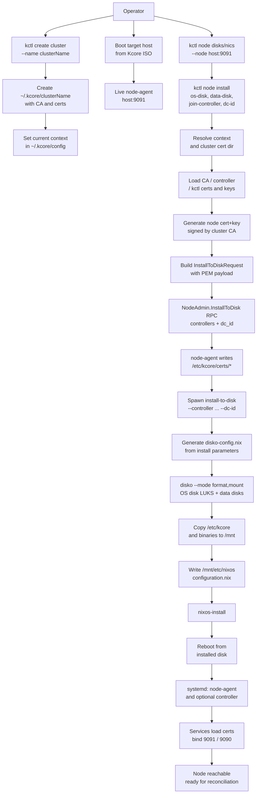
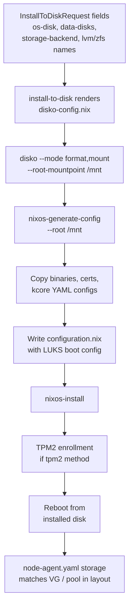
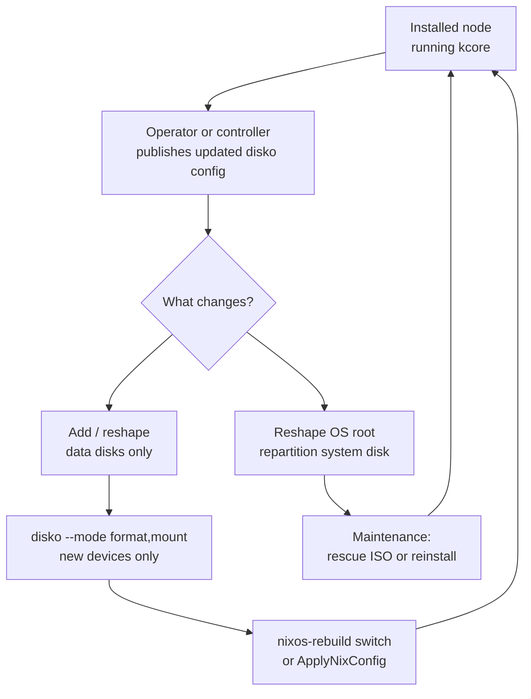

# Node Install Bootstrap Flow

This document defines the node installation procedure with cluster-scoped PKI material and certificate handoff from `kctl` to the target node.

## Goal

Install a node from live ISO to disk and ensure that, after reboot:
- `kcore-node-agent` can start with valid TLS files in `/etc/kcore/certs`
- the node can join or host the controller as configured
- certificate trust is anchored in the selected cluster CA

## Cluster-scoped PKI layout

Expected local layout on the operator machine:

- `~/.kcore/config` (contexts and current context)
- `~/.kcore/<cluster-name>/ca.crt`
- `~/.kcore/<cluster-name>/ca.key`
- `~/.kcore/<cluster-name>/controller.crt`
- `~/.kcore/<cluster-name>/controller.key`
- `~/.kcore/<cluster-name>/kctl.crt`
- `~/.kcore/<cluster-name>/kctl.key`

`kctl` selects a cluster context, resolves its cert directory, and uses that material for bootstrap.

## Procedure

1. Create/select cluster context and PKI.
2. Boot target host from Kcore ISO and confirm `node-agent` API is reachable.
3. Discover target devices (`node disks`, `node nics`).
4. Run `node install` with:
   - OS disk (required)
   - optional data disks
   - one or more join controller endpoints (ordered)
   - optional datacenter id (`dcId`, default `DC1`)
5. `kctl` prepares install PKI payload:
   - loads cluster CA and existing cert/key material
   - generates node cert/key signed by cluster CA (SAN = node host/IP)
6. `kctl` sends `InstallToDiskRequest` including cert PEM payload, ordered `controllers`, and `dc_id`.
7. Live `node-agent` writes certs to `/etc/kcore/certs` and starts `install-to-disk`.
8. Installer generates a `disko-config.nix` from install parameters and runs `disko --mode format,mount` to partition, encrypt, format, and mount disks declaratively.
9. Installer copies `/etc/kcore/*`, binaries, and NixOS config into `/mnt` on target disk.
10. `nixos-install` completes and host reboots from installed disk.
11. Installed services read `/etc/kcore/certs/*` and start successfully.

## Detailed flowchart

## Declarative disk layout (disko)

The live ISO's `install-to-disk` script uses [disko](https://github.com/nix-community/disko) for declarative disk partitioning, LUKS encryption, and filesystem creation. Disko replaces imperative `parted` / `cryptsetup` / `mkfs` commands with a single Nix-evaluated device graph. See also [storage](storage.md) for how data disks and VM backends relate.

### Install-time: RPC fields to disko-config.nix to format + mount

The `install-to-disk` script renders `InstallToDiskRequest` fields into a `/tmp/disko-config.nix` that describes the full device graph, then runs `disko --mode format,mount --root-mountpoint /mnt` to apply it.

**OS disk layout** (always present):

| Partition | Type | Content |
|-----------|------|---------|
| ESP | 512 MiB FAT32 | `/boot` (systemd-boot) |
| root | remaining space | LUKS2 ext4 `/` |

LUKS unlock method is auto-detected (TPM2 when `/sys/class/tpm/tpm0` exists, otherwise key-file). TPM2 enrollment happens after `nixos-install`.

When TPM2 is used, the installer now captures the generated recovery key as a root-only artifact:

- installed node: `/etc/kcore/recovery/luks-recovery-key.txt`
- live installer env: `/var/log/kcore/recovery-keys/<nodeId>-<timestamp>.txt` (or explicit `--recovery-key-output /path/file.txt`)

The artifact includes metadata (`nodeId`, disk/root UUID, creation timestamp) and a `recoveryKeySha256` fingerprint for audit/escrow workflows.

**Data disk layout** (when `--data-disk` is passed):

| Backend | disko content |
|---------|---------------|
| filesystem | GPT, single ext4 partition mounted at `/var/lib/kcore/volumes` |
| lvm | GPT, LVM PV, VG (named per `--lvm-vg-name`, default `vg_kcore`) |
| zfs | GPT, ZFS partition, zpool (named per `--zfs-pool-name`, default `tank0`) |

VGs and zpools are **created at install time** by disko. LVs / zvols are created later by `node-agent` on demand.

### Files on the installed system

After install, the following disko-related files are saved on the node:

- `/etc/nixos/disko-config.nix` -- the exact device graph used at format time (reference and day-2 use)
- `/etc/nixos/modules/kcore-disko.nix` -- NixOS module with `kcore.disko.*` options for generating disko layouts

### NixOS module: `modules/kcore-disko.nix`

A NixOS module that generates `disko.devices` from high-level options:

- `kcore.disko.osDisk` -- block device path (e.g. `/dev/sda`)
- `kcore.disko.luksPasswordFile` -- path to LUKS passphrase file (format-time only)
- `kcore.disko.dataDisks` -- list of data disk device paths
- `kcore.disko.storageBackend` -- `"filesystem"`, `"lvm"`, or `"zfs"`
- `kcore.disko.lvm.vgName` / `kcore.disko.zfs.poolName` -- backend-specific names

This module can be imported on any system that has the disko NixOS module available.

### Day-2: evolving layout on a running node

Formatting is never implicit on every boot. Day-2 changes follow these rules:

- **Add data disks only**: write a new disko config for the new devices, run `disko --mode format,mount`, then `nixos-rebuild switch` or `ApplyNixConfig` to update `fileSystems`.
- **Reshape OS root / repartition system disk**: this is a **reinstall-class** event requiring rescue ISO or node replacement.

The installed node has `disko` available in `environment.systemPackages` for day-2 formatting of new data devices.

## Verification checklist

- On live ISO (before install):
  - `kctl --node <host:9091> --insecure node disks`
  - `kctl --node <host:9091> --insecure node nics`
- During install:
  - install response includes accepted status and log path
  - logs show disko format+mount success and full installer progression
- After reboot:
  - `findmnt /` shows root on installed disk
  - `/etc/kcore/certs` exists with expected files
  - `/etc/nixos/disko-config.nix` exists with the device graph
  - if TPM2 was used: `/etc/kcore/recovery/luks-recovery-key.txt` exists and is mode `0400`
  - `systemctl is-active kcore-node-agent` is `active`
  - if same-host controller mode, `systemctl is-active kcore-controller` is `active`
  - if LVM data disks: `vgs` shows expected VG
  - if ZFS data disks: `zpool status` shows expected pool

## ISO-to-VM acceptance checklist (regression guard)

Run this sequence on every new ISO candidate:

1. Install first node from live ISO with controller mode:
   - `kctl --node <host:9091> --insecure node install --os-disk <disk> --data-disk <disk> --run-controller`
2. After reboot, verify first-node services:
   - `systemctl is-active kcore-controller kcore-node-agent`
3. Verify disko layout:
   - `lsblk` shows expected partition layout (ESP + LUKS root)
   - `/etc/nixos/disko-config.nix` exists and describes the installed layout
4. Verify image contract:
   - `kctl create vm smoke-no-image` must fail with URL/SHA-required error.
5. Create VM with Debian 12 direct URL + SHA256:
   - `kctl create vm smoke --image https://cloud.debian.org/images/cloud/bookworm/latest/debian-12-genericcloud-amd64.qcow2 --image-sha256 <sha256>`
6. Verify runtime realization (not just DB intent):
   - `systemctl status kcore-vm-smoke`
   - `ls /run/kcore/smoke.sock /run/kcore/smoke.serial.sock`
   - `ls /var/lib/kcore/images/` contains controller-derived cached image path
7. Verify console attach path:
   - `socat -,raw,echo=0,icanon=0 UNIX-CONNECT:/run/kcore/smoke.serial.sock`
